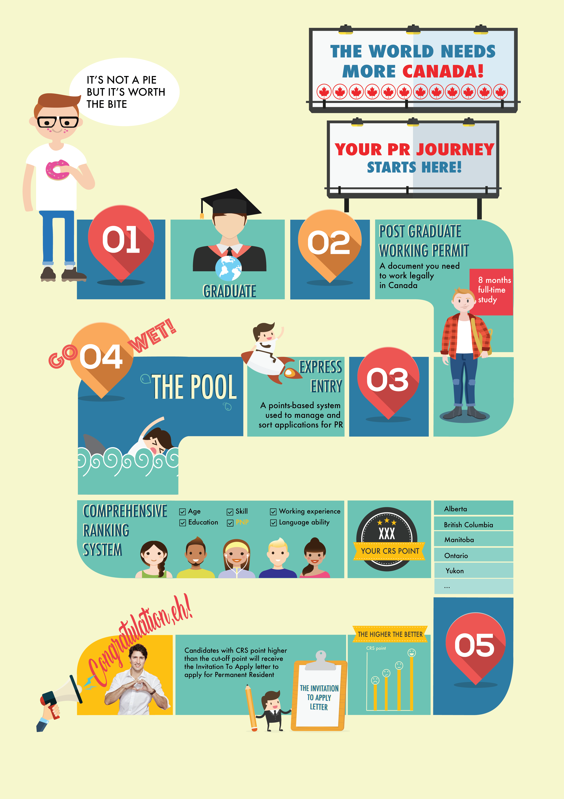
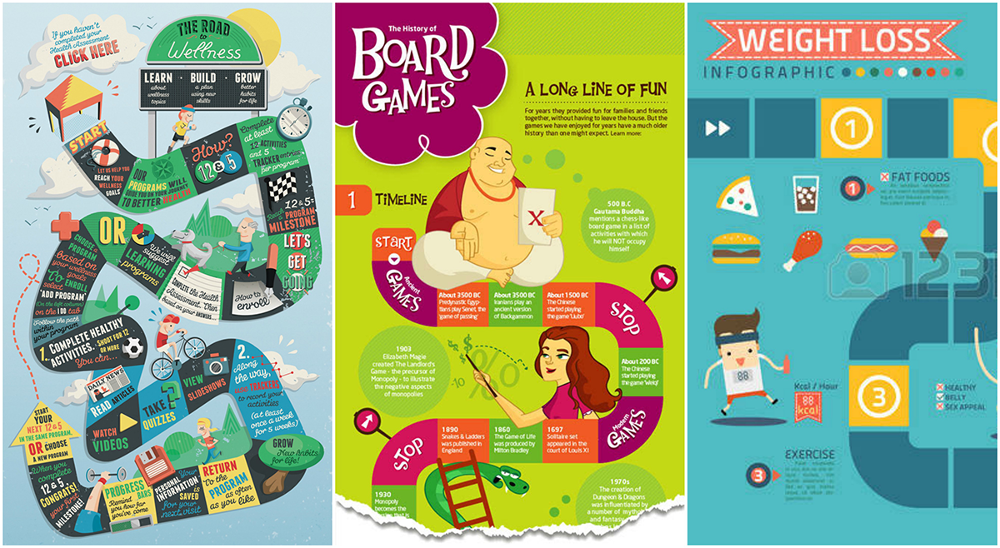
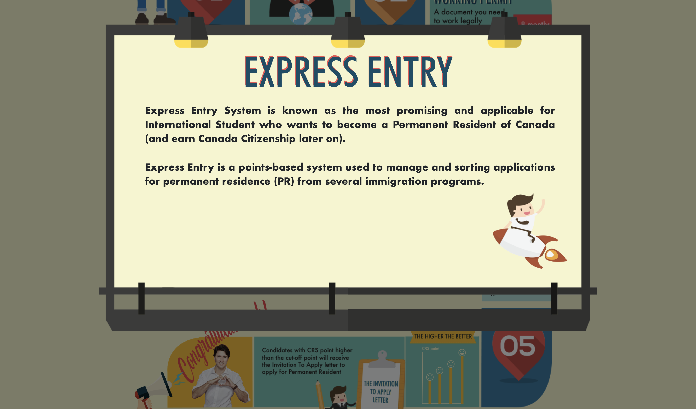
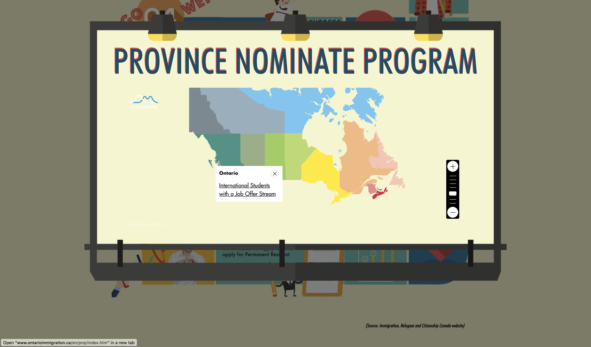
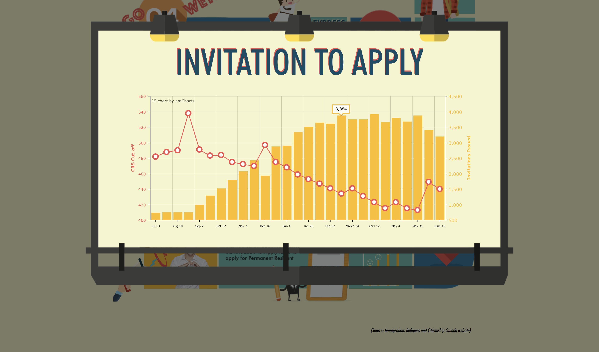

## The World needs more Canada! Your PR Journey starts here!

For the final project of the course User Interface Design Principles, the students had the opportunity to choose between making an animation, an interactive data-set or an infographic. 

As two international students, me and my classmate, Tat Dat Hoang, we decided to create an hybrid between the last two options: an interactive infographic about the process some people go through to be able to become a permanent resident in Canada. There are countless ways to get the residency, and after a lot of research we decided to focus on presenting the information that is relevant for Econommic Imigrants(1), specially the ones who decides to attend a public study institution.

### The inspiration

After the information is gathered and filtered, we decided that we wanted to our infographic to have a ludic feel of a boardgame board, to contrast with the serious information presented.

While the final design was made by Dat using resources from websites like freepik, I was responsible for the interaction, adding animations on hover and data-visualization api like google maps api and amcharts.

Notes:
(1) _Economic immigrants are people selected for their skills and ability to contribute to Canada's economy, including skilled workers, business immigrants, provincial and territorial nominees and live-in caregivers._
Font: [https://www.asiapacific.ca/statistics/immigration/arrivals/immigration-category-economic-immigrants](https://www.asiapacific.ca/statistics/immigration/arrivals/immigration-category-economic-immigrants)
